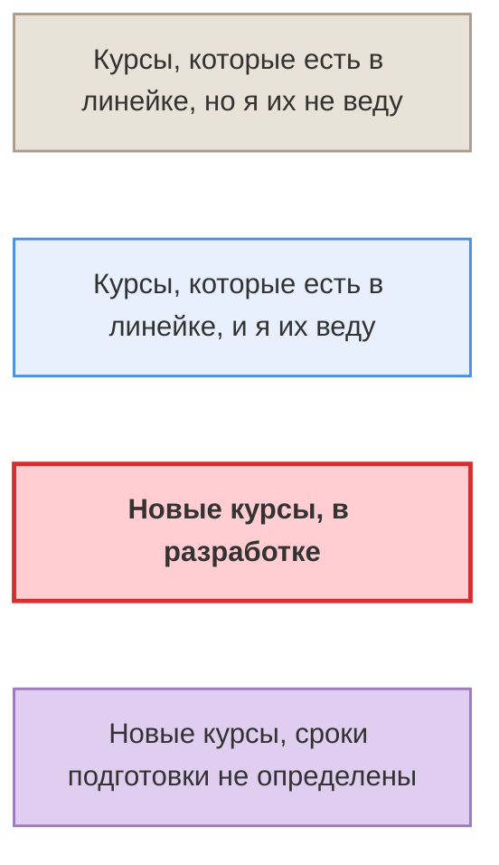
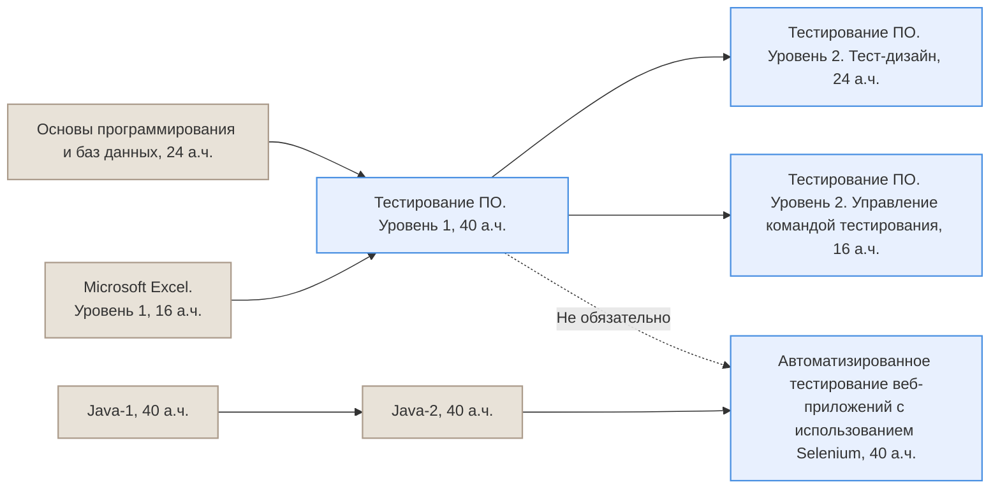
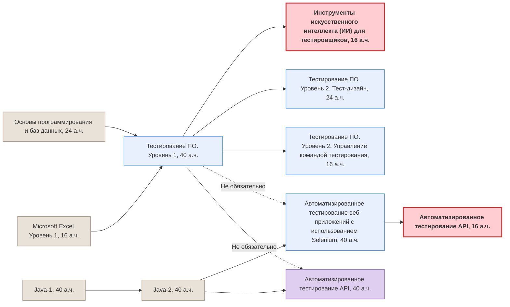
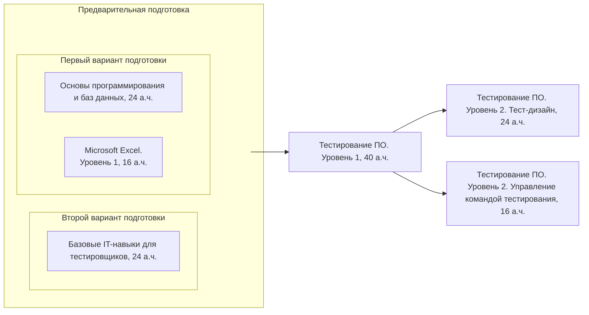
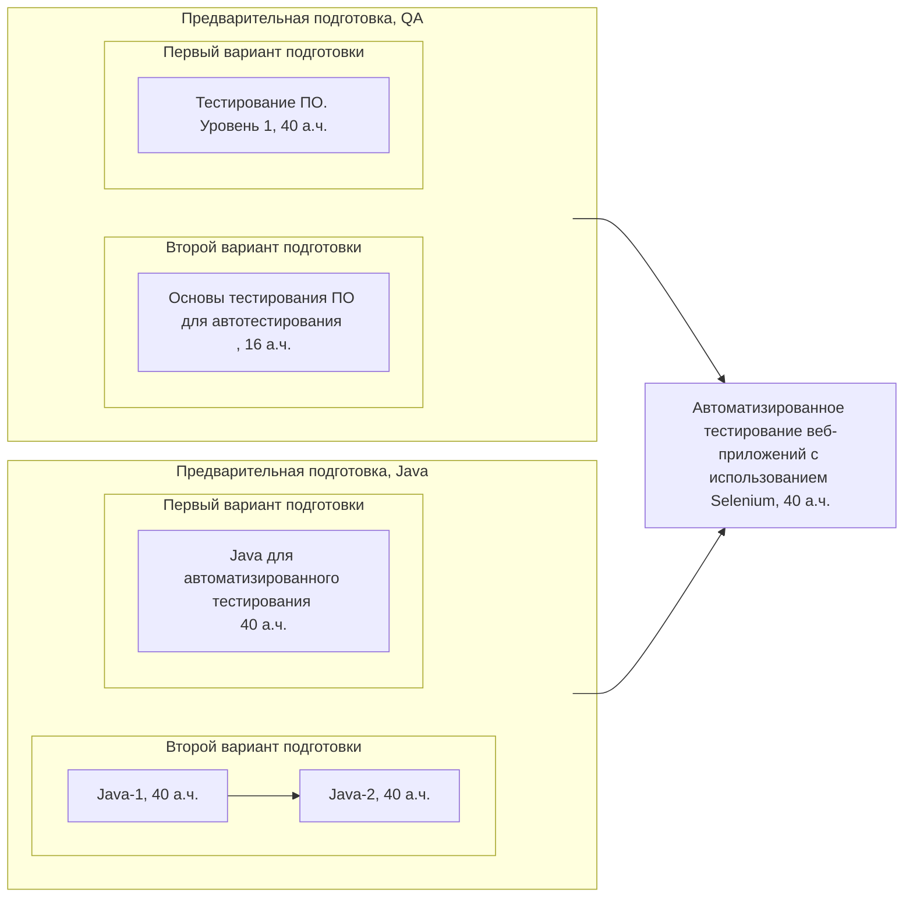

# Курсы по тестированию и обеспечению качества
## Легенда

## Существующая линейка курсов по тестированию

## Дополнительный курс по АТ

## Линейка курсов для ручного тестирования

## Линейка курсов для автоматизированного тестирования

